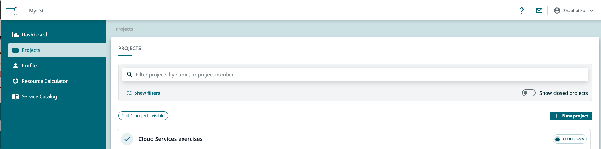
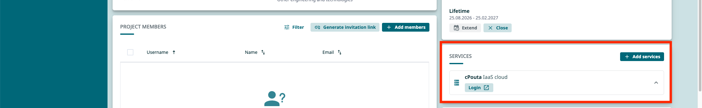
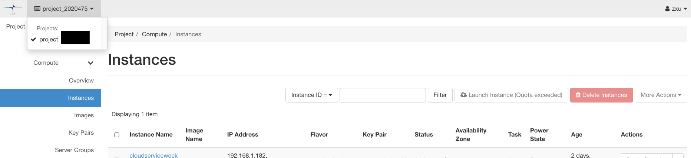
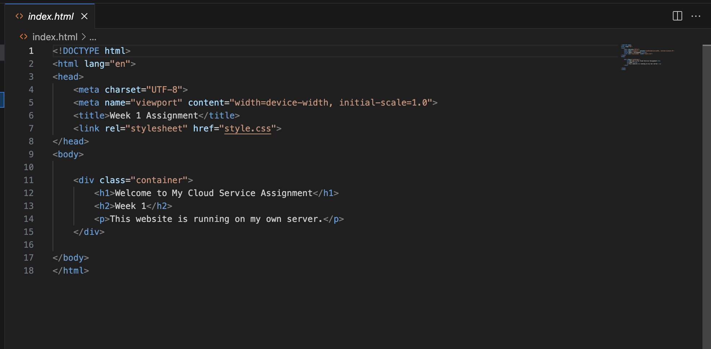
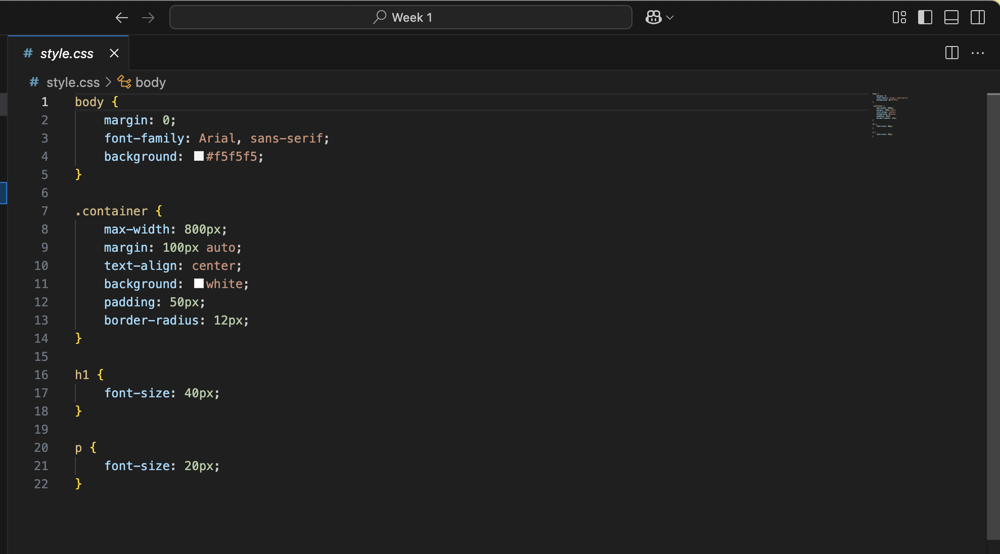

# Week 1 - VPS  Assignment

---

## Background: 
All the operations for this assignment are based on Macbook so the commands will be different than the instruction for Microsoft system.

I created my VPS into CSC cPouta. And the documented process are based on that.

## Result:
http://86.50.231.121/

## Process:

### 1. Creating the VPS
**Purpose:** *Create a virtual server in the cloud that can host and run applications and services.*

#### Creating the VPSSet up CSC account using credentials, it is free for students

- Create account on this page https://my.csc.fi/welcome, use Haka credentials to signup.
    - Login to my CSC and continue to create new project https://my.csc.fi/dashboard

#### Create project

- Create a new project following the instruction here
    - https://docs.csc.fi/accounts/how-to-create-new-project/
    - It should look like this after creating a new project
    

- Create cPouta services within your project
    
    - Login to cPouta service https://pouta.csc.fi/dashboard/auth/login/?next=/dashboard/ using the Haka credentials

- Create Virtual Machine
    - Follow the instruction here: https://docs.csc.fi/cloud/pouta/launch-vm-from-web-gui/
    - Create instance within your own project
    
    - Use Ubuntu-26 as the image when setting up VM

- Create SSH keypair and keep it safe
    - Security group set up, open ports for SSH connection
        - 22 (SSH)
        - 80 (HTTP)
        
### 2. Connecting to the VPS with SSH
**Purpose:** *Establish a secure remote connection to the VPS and manage the server from the local computer.*

#### Create a local .pem file and copy the private key generated by cPouta into it

- `touch ~/Desktop/mykey.pem` - This will create a .pem file on desktop
- `nano ~/Desktop/mykey.pem` - Write SSH key into .pem file
- `mv ~/Desktop/mykey.pem ~/.ssh/csc-key.pem` - Move mykey.pem to .ssh folder
- `chmod 400 ~/.ssh/csc-key.pem` - Restrict the key file's permission

#### Connect to server

- `ssh -i ~/.ssh/csc-key.pem ubuntu@your own public IP` - You can check the IP from Instance

### 3. Update the Linux system

#### Retrieve the latest package list from the Ubuntu software repositories.

- `sudo apt update`
- `sudo apt upgrade -y`

### 4. Install the Web Server

#### Check whether Apache2 is installed:

 - `apache2 -v` - Check if you have, continue the step
 - `sudo systemctl status apache2` - Check the status of Apache2

#### If you don't have Apache 2

- `sudo apt install apache2` - Install Apache2
- `sudo systemctl status apache2` - Check the status of Apache2

### 5. Testing the Web Server

#### Check if everything works on the browser:
- http://your.public.IP/

### 6. Creating My Own Website

#### I created a simple static website for deployment testing.

### 7. Deploy My Website (How to load own site to server)

#### From local machine to Ubuntu server

- `scp -i ~/.ssh/csc-key.pem -r "/file path/"* ubuntu@public IP:/tmp/` - Temporarily copy the files from local machine to the `/tmp` directory on the Ubuntu server.
- `ssh -i ~/.ssh/csc-key.pem ubuntu@@public IP` - Enter server
- `ls/tmp` - Check if all the files are under `/tmp` directory

#### Deploy the website files 

- `sudo cp /tmp/index.html /var/www/html/` 
- `sudo cp /tmp/style.css  /var/www/html/` 

#### Check if all files are deployed and the site has changed
- `ls -l /var/www/html/` 

### 8. Final Result

#### My own site after deployment
- http://86.50.231.121/

### 9. Summary (Learning outcome)
- [x] Know how to create cPouta project, services and Virtual machine
- [x] Know how to connect VPM with SSH
- [x] Know how to update Linux and install the web server
- [x] Know how to deploy from own machine to server
- [x] The main purpose of this assignment was to understand the basic workflow of turning a cloud VM into a publicly accessible web server.
