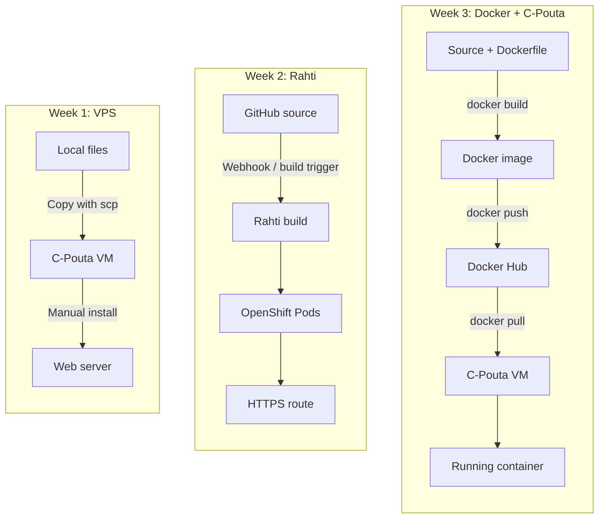
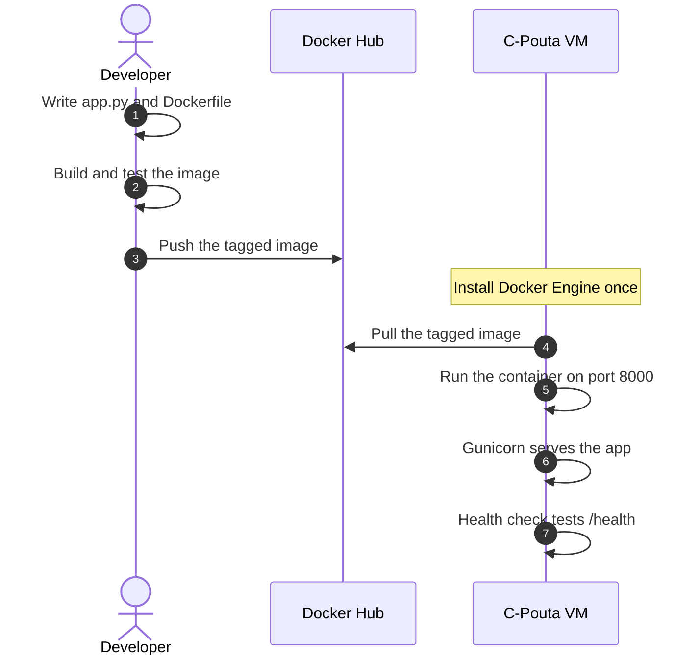

# Week 3 - Docker Deployment on CSC C-Pouta

This week I deployed a small Flask application in a Docker container. The
container image was built on my MacBook, pushed to Docker Hub, and then run on
an Ubuntu virtual machine in CSC C-Pouta.

The main difference from Week 1 is that the application now runs inside a
portable Docker image. The main difference from Week 2 is that I managed the
container on my own C-Pouta VM instead of using Rahti to build and manage the
application automatically.

---

## 1. Three-Week Comparison

| Topic                    | Week 1: VPS                     | Week 2: Rahti                           | Week 3: Docker + C-Pouta                   |
| :----------------------- | :------------------------------ | :-------------------------------------- | :----------------------------------------- |
| Cloud platform           | C-Pouta VM                      | CSC Rahti (OpenShift)                   | C-Pouta VM                                 |
| Application runtime      | Python process on Ubuntu        | OpenShift Pod                           | Docker container with Gunicorn             |
| Build method             | Manual server setup             | Rahti builds from GitHub with S2I       | Build locally with a Dockerfile            |
| Where the image is built | No container image              | Rahti builds it automatically           | My local computer builds it                |
| Image storage            | Not used                        | Managed by Rahti                        | Docker Hub                                 |
| Deployment               | Copy files and configure the VM | Git push triggers a platform build      | Pull the image and run it on the VM        |
| Scaling and recovery     | Mostly manual                   | OpenShift manages replicas and recovery | Docker runs one manually managed container |
| Public access            | VM IP and open port 80          | HTTPS route from Rahti                  | VM IP and open port 8000                   |

### What changed each week?

- **Week 1:** I learned the basic VM workflow: create a server, install a web
  server, copy files, and serve a website.
- **Week 2:** Rahti automated more of the deployment. GitHub was connected to
  OpenShift, which built the application and ran it in Pods. Rahti also added
  HTTPS, replicas, and self-healing.
- **Week 3:** I learned the Docker workflow in more detail. I wrote the image
  recipe, built the image locally, stored it in Docker Hub, and started the
  same image on a C-Pouta VM.

### Architecture flowchart



## 2. Application Files

### `app.py`

The Flask application has two endpoints:

- `/` displays a simple page and the container hostname.
- `/health` returns `{"status": "ok"}` for the Docker health check.

```python
import os
import socket

from flask import Flask, jsonify, render_template_string

app = Flask(__name__)

PAGE = """<!doctype html>
<html lang="en">
  <head>
    <meta charset="utf-8">
    <meta name="viewport" content="width=device-width, initial-scale=1">
    <title>Flask container demo</title>
  </head>
  <body>
    <h1>Hello from a Flask container</h1>
    <p>This page is served by Gunicorn inside Docker.</p>
    <p>Container hostname: <code>{{ hostname }}</code></p>
  </body>
</html>"""

@app.get("/")
def index():
    return render_template_string(PAGE, hostname=socket.gethostname())

@app.get("/health")
def health():
    return jsonify(status="ok")

if __name__ == "__main__":
    app.run(host="0.0.0.0", port=int(os.getenv("PORT", "8000")))
```

### `requirements.txt`

```text
Flask==3.1.0

```

### `Dockerfile`

```dockerfile
FROM python:3.12-slim

ENV PYTHONDONTWRITEBYTECODE=1 \
    PYTHONUNBUFFERED=1

WORKDIR /app

COPY requirements.txt .
RUN pip install --no-cache-dir -r requirements.txt \
    && useradd --create-home appuser

COPY --chown=appuser:appuser app.py .

USER appuser
EXPOSE 8000

HEALTHCHECK --interval=30s --timeout=3s --start-period=5s \
    CMD python -c "import urllib.request; urllib.request.urlopen('http://127.0.0.1:8000/health')" || exit 1

CMD ["gunicorn", "--workers", "2", "--bind", "0.0.0.0:8000", "app:app"]
```

The image uses a non-root user, listens on port 8000, and checks the `/health`
endpoint regularly. These settings make the container safer and easier to
monitor.

### `.dockerignore`

```text
__pycache__/
*.py[cod]
.git/
.venv/
.env
```

## 3. Deployment Flow



## 4. Deployment Steps

### Step 1: Build and test locally

```bash
docker build -t flask-container-lab:local .
docker run -d --name flask-local -p 8000:8000 flask-container-lab:local
docker ps
docker logs flask-local
```

Test the application in a browser at <http://localhost:8000/>. The health
endpoint is available at <http://localhost:8000/health>.

Stop the local container when the test is complete:

```bash
docker rm -f flask-local
```

### Step 2: Push the image to Docker Hub

The image tag must start with my own Docker Hub username. Otherwise Docker Hub
can return `push access denied` or `insufficient_scope`.

```bash
docker login
docker tag flask-container-lab:local jessxu123/flask-container-lab:1.0.0
docker push jessxu123/flask-container-lab:1.0.0
```

### Step 3: Install Docker on the C-Pouta VM

Run these commands after connecting to the Ubuntu VM with SSH:

```bash
sudo install -m 0755 -d /etc/apt/keyrings
sudo curl -fsSL https://download.docker.com/linux/ubuntu/gpg \
  -o /etc/apt/keyrings/docker.asc
sudo chmod a+r /etc/apt/keyrings/docker.asc

echo \
  "deb [arch=$(dpkg --print-architecture) signed-by=/etc/apt/keyrings/docker.asc] https://download.docker.com/linux/ubuntu \
  $(. /etc/os-release && echo "$UBUNTU_CODENAME") stable" | \
  sudo tee /etc/apt/sources.list.d/docker.list > /dev/null

sudo apt update
sudo apt install -y docker-ce docker-ce-cli containerd.io \
  docker-buildx-plugin docker-compose-plugin
```

### Step 4: Pull and run the production container

```bash
sudo docker pull jessxu123/flask-container-lab:1.0.0
sudo docker run -d \
  --name flask-prod \
  -p 8000:8000 \
  jessxu123/flask-container-lab:1.0.0
```

Check the deployment:

```bash
sudo docker ps
sudo docker logs flask-prod
curl http://localhost:8000/health
```

The expected health response is:

```json
{ "status": "ok" }
```

## 5. Network Configuration

The C-Pouta Security Group must allow inbound TCP traffic on port `8000`.
After opening the port, the application can be visited with:

```text
http://<public-vm-ip>:8000/
```

This is different from Week 1, where the web server used port 80, and Week 2,
where Rahti provided a public HTTPS route.

## 6. Troubleshooting

### Docker Hub rejects the push

Check that the image name starts with the correct Docker Hub username:

```bash
docker tag flask-container-lab:local <dockerhub-username>/flask-container-lab:1.0.0
docker push <dockerhub-username>/flask-container-lab:1.0.0
```

### The website cannot be reached

Check these three things:

1. The container is running: `sudo docker ps`.
2. The application answers inside the VM: `curl http://localhost:8000/health`.
3. The C-Pouta Security Group allows TCP port `8000`.

### The updated code is not visible

Build and push a new image tag, then pull and run that tag on the VM. A running
container does not change automatically when the local source code changes.

## 7. Learning Outcome

- [x] Build and test a Flask application in a Docker container.
- [x] Write a Dockerfile with a non-root user and a health check.
- [x] Push a versioned image to Docker Hub.
- [x] Pull and run the same image on a C-Pouta VM.
- [x] Explain the difference between VM deployment, PaaS deployment, and Docker
      image deployment.

Week 3 connected the two earlier ideas: it kept the control of a C-Pouta VM
from Week 1, while adding the portable container image from Week 2. Compared
with Rahti, this approach requires more manual work, but it makes each Docker
step visible and easier to understand.
