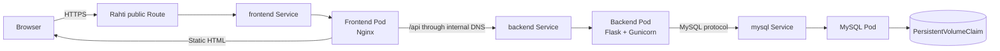
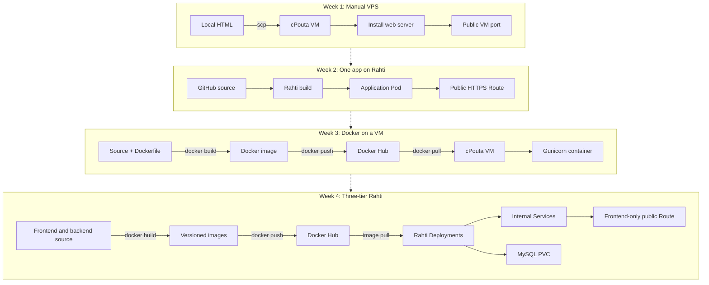
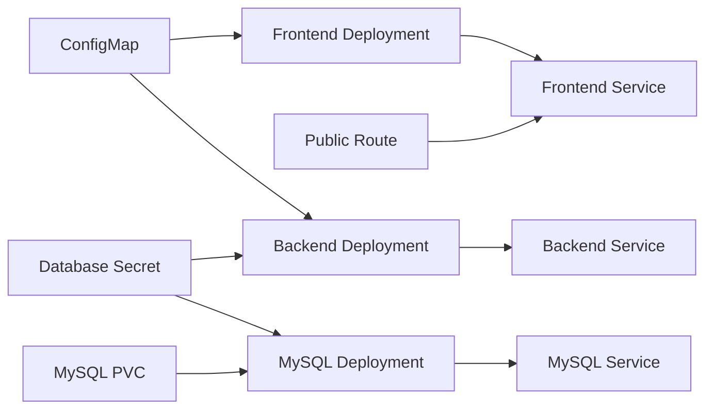

# Week 4 - Containerized LEMP Stack Deployment on CSC Rahti

## Overview

In Week 4, I converted the three-container application from the previous
Docker Compose deployment into a Kubernetes/OpenShift deployment on **CSC
Rahti**.

The application has three tiers:

- **Frontend:** Nginx serves the static web page and proxies `/api` requests.
- **Backend:** Flask and Gunicorn provide the REST API.
- **Database:** MySQL stores persistent application data.

The important security requirement is that **only the frontend is publicly
accessible**. The backend and MySQL database communicate through internal
Rahti Services and are not exposed through public Routes.

## Architecture

### Week 4 Application Architecture



### What Is Public and What Is Private?

| Component | Public access                | Internal access       | Purpose                              |
| :-------- | :--------------------------- | :-------------------- | :----------------------------------- |
| Frontend  | Yes, through the HTTPS Route | Yes                   | Serves HTML and proxies API requests |
| Backend   | No public Route              | `http://backend:8000` | Runs the REST API                    |
| MySQL     | No public Route or host port | `mysql:3306`          | Stores application data              |

The browser never connects directly to either the backend or MySQL. This keeps
the internal application layers off the public Internet and ensures that the
frontend remains the single public entry point.

## Four-Week Comparison

| Topic          | Week 1: VPS          | Week 2: Rahti app         | Week 3: Docker + cPouta     | Week 4: Three-tier Rahti                        |
| :------------- | :------------------- | :------------------------ | :-------------------------- | :---------------------------------------------- |
| Main platform  | cPouta VM            | CSC Rahti/OpenShift       | cPouta VM                   | CSC Rahti/OpenShift                             |
| Application    | Static website       | One containerized web app | Flask container             | Nginx + Flask + MySQL                           |
| Runtime unit   | Process on a VM      | OpenShift Pod             | Docker container            | OpenShift Pods managed by Deployments           |
| Build process  | Manual server setup  | Rahti builds from GitHub  | Local Docker build          | Images built locally and pulled from Docker Hub |
| Image registry | Not used             | Managed by Rahti          | Docker Hub                  | Docker Hub                                      |
| Networking     | VM IP and open ports | Service and public Route  | Published VM port           | Internal Services and one public Route          |
| Database       | Not included         | Not included              | Not included                | MySQL with persistent storage                   |
| Public access  | VM port 80           | Public HTTPS Route        | VM port 8000                | Frontend Route only                             |
| Scaling        | Manual VM changes    | OpenShift replicas        | Manual container management | Deployment replica management                   |
| Recovery       | Mostly manual        | OpenShift self-healing    | Docker restart policy       | OpenShift self-healing                          |
| Configuration  | Files on the server  | OpenShift resources       | Environment variables       | ConfigMap and Secrets                           |

### How the Deployment Model Developed

- **Week 1:** I learned the basic infrastructure workflow: create a VM,
  connect with SSH, install a web server, copy files, and open a firewall port.
- **Week 2:** I deployed a container to Rahti and learned about Pods, Services,
  Routes, replicas, scaling, and self-healing.
- **Week 3:** I learned the Docker image lifecycle: write a Dockerfile, build
  locally, tag the image, push it to Docker Hub, pull it on a VM, and run it.
- **Week 4:** I combined those ideas into a real three-tier application. Docker
  Compose is replaced by Kubernetes/OpenShift resources, and the application
  is divided into independently managed frontend, backend, and database tiers.

### Deployment Flow Compared with Earlier Weeks



## Main Concepts

### Docker Images

The frontend and backend are packaged as separate images. A Docker image is an
immutable package containing the application code, runtime, dependencies, and
startup command. The images are built locally and pushed to Docker Hub so that
Rahti can pull them when creating Pods.

Versioned image tags such as `1.0.0` make deployments reproducible. The
`latest` tag is convenient for learning, but an exact version is better for
production because it clearly identifies the code being deployed.

### Deployments and Pods

A **Deployment** describes the desired state of an application, including its
container image, environment variables, ports, and replica count. OpenShift
creates and manages the corresponding Pods. If a Pod crashes or is deleted,
the Deployment creates a replacement.

The frontend and backend can be scaled independently. MySQL is normally kept at
one replica in this assignment because the database storage and replication
strategy have not been designed for multiple database replicas.

### Services and Internal DNS

A **Service** provides a stable internal address even when Pods are replaced.
The backend can reach MySQL through the Service name `mysql`, and the frontend
can reach the backend through `backend`:

```text
frontend -> http://backend:8000/api
backend  -> mysql:3306
```

These names are resolved by the internal cluster DNS. No Pod IP address should
be hard-coded because Pod IPs are temporary.

### Route

An OpenShift **Route** maps a public hostname to a Service. The frontend Service
has the only public Route in this assignment. The backend and MySQL Services are
cluster-internal and do not have Routes.

This is the Rahti equivalent of exposing only the Nginx port in the production
Docker Compose file. In Compose, the frontend used a published host port while
the backend and database stayed on the private Docker network. In Rahti, the
frontend uses a Route and the other components use internal Services.

### ConfigMap and Secret Configuration

A **ConfigMap** stores non-sensitive configuration such as:

- the backend host name;
- the backend port;
- the database name;
- the frontend API path.

A **Secret** should store sensitive values such as:

- the MySQL root password;
- the application database password.

Passwords should not be committed to a public GitHub repository. The example
configuration below uses placeholders and must be replaced with real Rahti
Secrets during deployment.

### PersistentVolumeClaim

Containers are replaceable, so data stored only inside a MySQL container can be
lost when the Pod is recreated. A **PersistentVolumeClaim (PVC)** requests
persistent storage from Rahti and mounts it at MySQL's data directory:

```text
MySQL Pod -> /var/lib/mysql -> PersistentVolumeClaim -> PersistentVolume
```

The PVC protects the database data across normal Pod restarts and rescheduling.
It does not replace backups, so important data should also be exported with a
database backup procedure.

### Resource Relationship



## Deployment Process

### 1. Build and Push the Images

Run these commands from the project directory containing the `frontend` and
`backend` directories. The Docker Hub username must match the account used by
`docker login`.

```bash
docker login

docker build -f backend/Dockerfile \
	-t username/lempbackend:1.0.0 .
docker push username/lempbackend:1.0.0

docker build -f frontend/Dockerfile \
	-t username/lempfrontend:1.0.0 .
docker push username/lempfrontend:1.0.0
```

The image name must use the authenticated Docker Hub account. For example,
`jessiexu123/...` cannot be pushed while logged in as `jessxu123` unless the
repository belongs to or is writable by that account. This caused the
`insufficient_scope` error during the image upload.

### 2. Log in to Rahti

```bash
oc login https://api.2.rahti.csc.fi:6443 --token=<TOKEN>
oc project <project-name>
```

The access token should be copied from the Rahti web console and should never be
committed to GitHub.

### 3. Create the Database Storage and Configuration

Apply the PVC, ConfigMap, and Secret before starting the application:

```bash
oc apply -f rahti/mysql-pvc.yaml
oc apply -f rahti/configmap.yaml
oc create secret generic mysql-secret \
	--from-literal=MYSQL_ROOT_PASSWORD='<strong-root-password>' \
	--from-literal=DB_PASSWORD='<strong-app-password>'
```

If the Secret is already defined in a YAML file, use `oc apply -f` instead and
keep the file outside a public repository when it contains real credentials.

### 4. Deploy MySQL

```bash
oc apply -f rahti/mysql-deployment.yaml
oc apply -f rahti/mysql-service.yaml
oc get pods
oc get pvc
```

The MySQL Deployment should use the official MySQL image, mount the PVC at
`/var/lib/mysql`, and load its password from the Secret. The MySQL Service
should expose port `3306` only inside the Rahti project.

### 5. Deploy the Backend

```bash
oc apply -f rahti/backend-deployment.yaml
oc apply -f rahti/backend-service.yaml
oc rollout status deployment/backend
```

The backend Deployment should:

- use `username/lempbackend:1.0.0` or the final image tag;
- listen on container port `8000`;
- set `DB_HOST=mysql`;
- read the database name and password from configuration resources;
- depend on the MySQL Service through internal DNS;
- have no public Route.

### 6. Deploy the Frontend

```bash
oc apply -f rahti/frontend-deployment.yaml
oc apply -f rahti/frontend-service.yaml
```

The frontend image contains the Nginx configuration. Its `/api` location must
proxy to the backend Service, for example:

```nginx
location /api {
		proxy_pass http://backend:8000;
		proxy_set_header Host $host;
		proxy_set_header X-Real-IP $remote_addr;
		proxy_set_header X-Forwarded-For $proxy_add_x_forwarded_for;
		proxy_set_header X-Forwarded-Proto $scheme;
}
```

The browser calls `/api` on the same public origin. Nginx handles the internal
hop to `backend:8000`, so the browser does not need to know the backend's
cluster address.

### 7. Create the Public Route

```bash
oc expose service frontend
oc get route frontend
```

The resulting hostname is the public application address. Only the frontend
Service should be exposed this way. Do not run `oc expose service backend` or
create a Route for MySQL.

### 8. Verify the Complete Application

```bash
oc get deployments
oc get pods
oc get services
oc get route

oc logs deployment/frontend --tail=100
oc logs deployment/backend --tail=100
oc logs deployment/mysql --tail=100
```

Open the frontend Route in a browser. Confirm that:

- the static frontend page loads;
- the page receives a response from `/api`;
- the displayed value includes data read from MySQL;
- a write operation persists after refreshing the page;
- the backend and MySQL have no public Route.

An internal backend check can be performed from a temporary Pod:

```bash
oc run curl-test --rm -it --restart=Never \
	--image=curlimages/curl -- \
	curl -sS http://backend:8000/api
```

The exact API path depends on the application implementation. The important
point is that the request is made inside the Rahti network.

## Docker Compose to Rahti Mapping

| Docker Compose concept  | Rahti/OpenShift equivalent                              |
| :---------------------- | :------------------------------------------------------ |
| `services.backend`      | `backend` Deployment and Service                        |
| `services.frontend`     | `frontend` Deployment and Service                       |
| `services.db`           | `mysql` Deployment and Service                          |
| `build:`                | A pre-built image pushed to Docker Hub                  |
| `environment:`          | ConfigMap and Secret references                         |
| `depends_on:`           | Service DNS, readiness checks, and rollout verification |
| `ports: 8080:80`        | Public Route to the frontend Service                    |
| Private Compose network | Internal Rahti Service network                          |
| Named volume `db_data`  | PersistentVolumeClaim                                   |
| `docker compose up -d`  | `oc apply -f` and Deployment reconciliation             |
| `docker compose logs`   | `oc logs`                                               |
| `docker compose ps`     | `oc get pods` and `oc get deployments`                  |

Compose starts a group of containers on one Docker host. Rahti describes the
desired state of separate resources, and OpenShift schedules, monitors, and
recreates the Pods. This makes the deployment more declarative and resilient,
but it also requires explicit Kubernetes resources for networking, storage, and
configuration.

## Troubleshooting

### The frontend loads but `/api` fails

Check the Nginx proxy target and Service name:

```bash
oc get service backend
oc get endpoints backend
oc logs deployment/frontend
oc logs deployment/backend
```

The proxy target should use the internal Service name, such as
`http://backend:8000`, not `localhost` and not a Pod IP.

### The backend cannot connect to MySQL

```bash
oc get service mysql
oc get pods
oc logs deployment/mysql
oc logs deployment/backend
```

Check that `DB_HOST` is `mysql`, the database credentials match, and MySQL is
ready before testing the API. A Service can exist while its Endpoints are empty
if the MySQL Pod is not ready.

### MySQL data disappears

Check that the PVC is bound and mounted:

```bash
oc get pvc
oc describe pod -l app=mysql
```

The MySQL data directory must be mounted at `/var/lib/mysql`. Do not store
database data only in the writable layer of the container.

### ImagePullBackOff

```bash
oc describe pod <pod-name>
```

Check the image name, tag, Docker Hub repository visibility, and image pull
credentials. A typo in the registry username or repository name prevents Rahti
from pulling the image.

### The public Route does not work

```bash
oc get route frontend
oc get service frontend
oc get endpoints frontend
```

The Route must point to the frontend Service, and the Service selector must
match the labels on the frontend Pods.

## Security and Operations Notes

- Expose only the frontend through a public Route.
- Do not publish MySQL port `3306` or create a database Route.
- Do not create a public backend Route unless a separate requirement explicitly
  needs one.
- Store passwords in Secrets, not in Dockerfiles, Git, or public ConfigMaps.
- Use versioned image tags instead of relying only on `latest`.
- Use non-root container images where the image and application support it.
- Add readiness and liveness probes so OpenShift can distinguish starting,
  healthy, and failed containers.
- Back up the database independently of the PVC.
- Review resource requests and limits before running a larger deployment.

## Conclusion

Week 4 is the first assignment in this sequence that combines a public web
interface, an internal API, and persistent database storage. Week 1 provided
the VM foundation, Week 2 introduced Rahti orchestration, and Week 3 explained
the Docker image lifecycle. Week 4 brings these concepts together in a
cloud-native three-tier deployment where each component has a clear role and
network boundary.
