# Week 6 - Frontend CI/CD and Observability on CSC Rahti

## Overview

Week 6 extends the multi-container application from Weeks 4 and 5 with a GitHub
Actions deployment pipeline and basic observability. The pipeline builds and
deploys the **frontend image only**. The Flask backend, MySQL database, and
Redis cache continue to run as separate Rahti workloads and are not updated by
this workflow.

I chose the frontend because this application's page layout, text, and static
assets are expected to change more often than its API contract or database
schema. An independent frontend release lets me publish presentation changes
without rebuilding or restarting the backend and data services. This is a
project-specific release choice, not a claim that backends never need frequent
updates. Backend changes still need their own build and deployment pipeline.

The frontend uses Nginx on port `8080`. It serves the page, proxies `/api`
requests to the internal `backend-service`, exposes HTTP liveness and readiness
probes, and writes JSON access logs to stdout. The backend, MySQL, and Redis
remain internal to the Rahti project.

## Architecture

### Application and CI/CD Flow

```mermaid
flowchart LR
    Dev[Developer changes frontend] --> Push[Push to main]
    Push --> Actions[GitHub Actions]
    Actions --> Checkout[Checkout source]
    Checkout --> Build[Build frontend Docker image]
    Build --> Tags[Tag with commit SHA and latest]
    Tags --> Registry[Push to Docker Hub]
    Registry --> Login[Install oc and log in to Rahti]
    Login --> Project[Select week6-assignment]
    Project --> SetImage[oc set image to SHA tag]
    SetImage --> Rollout[Wait for frontend rollout]
    Rollout --> Frontend[Frontend Deployment]
    Browser[Browser] --> Route[HTTPS edge Route]
    Route --> FrontendService[frontend-service]
    FrontendService --> Frontend
    Frontend -->|Nginx proxies /api| BackendService[backend-service]
    BackendService --> Backend[Flask backend]
    Backend --> Database[MySQL + PVC]
    Backend --> Cache[Redis cache]
```



The image in `week-6/rahti/frontend-deployment.yaml` is the initial `latest`
image used when creating the Deployment. Each CI run pushes both `latest` and
an immutable commit-SHA tag, then uses `oc set image` to deploy the SHA tag.
The SHA in the Actions run should match the image shown in the live
Deployment. Do not re-apply the initial manifest after a CI deployment unless
you intentionally want to replace the live SHA tag with `latest`.

### Why Deploy Only the Frontend?

The frontend contains the user interface and static documentation. Changes to
these files can be released independently while preserving the currently
running backend API and its data services. The Nginx frontend still depends on
the internal backend API for `/api/todos`, so this pipeline does not imply that
the backend can never change. A backend code change requires a separate backend
image build and deployment.

## GitHub Actions Pipeline

The workflow is `.github/workflows/deploy.yml`. It runs on every push to
`main`; `workflow_dispatch` also allows a manual run. The build context is
`week-6`, and the Dockerfile is `week-6/frontend/Dockerfile`.

The workflow uses these GitHub repository secrets:

| Secret            | Purpose                                             |
| :---------------- | :-------------------------------------------------- |
| `DOCKER_USERNAME` | Docker Hub account and image namespace              |
| `DOCKER_PASSWORD` | Docker Hub access token/password for pushing images |
| `RAHTI_TOKEN`     | Rahti/OpenShift login token                         |
| `RAHTI_SERVER`    | Rahti API server URL                                |

Create them under **GitHub repository → Settings → Secrets and variables → Actions**.
Never put their values in this file, a ConfigMap, a screenshot, or a public
commit.

### Pipeline Steps

1. Check out the repository.
2. Log in to Docker Hub with repository secrets.
3. Build the frontend image from `week-6/frontend/Dockerfile`.
4. Push two tags: `todo-frontend:<commit-sha>` and `todo-frontend:latest`.
5. Install `oc`, log in to Rahti, and explicitly select `week6-assignment`.
6. Set the frontend container image to the immutable SHA tag and wait for the
   Deployment rollout.

The key deploy command is:

```bash
oc set image deployment/frontend-deployment \
  frontend=${DOCKER_USERNAME}/todo-frontend:${GITHUB_SHA}
oc rollout status deployment/frontend-deployment --timeout=180s
```

In GitHub Actions, the values are supplied using `${{ secrets.DOCKER_USERNAME }}`
and `${{ github.sha }}`. Do not run a later `oc apply` using a stale image value
if that would replace the SHA tag deployed by the workflow.

### CI/CD Evidence

- Figure 6: successful push-triggered Actions run.
- Figure 7: image tag in Rahti. Confirm its SHA matches the commit SHA shown in
  Figure 6.
- Figure 8: workflow video, if needed as supplemental evidence.

If the image screenshot shows `latest` or an older version rather than the SHA
from the successful run, update the screenshot after a new successful push.
The point is to demonstrate an actual deployment change, not only a green
workflow status.

## Initial Rahti Deployment

These commands are run from the repository root. The target project is
`week6-assignment`.

### 1. Log in and Select the Project

Replace the token placeholder locally. Do not commit a real token.

```bash
oc login https://api.2.rahti.csc.fi:6443 --token='<RAHTI_TOKEN>'
oc project week6-assignment
oc project
```

### 2. Create Rahti Secrets

The backend and MySQL manifests refer to `mysql-secret`; the backend also
refers to `unsplash-secret`. Create these in the `week6-assignment` project.
Replace the placeholders in your terminal only. Do not save real values in
Git.

```bash
oc create secret generic mysql-secret \
  --from-literal=MYSQL_ROOT_PASSWORD='<MYSQL_ROOT_PASSWORD>' \
  --from-literal=DB_PASSWORD='<DB_PASSWORD>' \
  --dry-run=client -o yaml | oc apply -f -

oc create secret generic unsplash-secret \
  --from-literal=UNSPLASH_ACCESS_KEY='<UNSPLASH_ACCESS_KEY>' \
  --dry-run=client -o yaml | oc apply -f -
```

If no Unsplash API key is available, the backend's fallback image is used; the
Secret still needs to exist because the Deployment references it.

### 3. Apply the Week 6 Resources

The directory contains the ConfigMap, PVC, Deployments, and internal Services
for the frontend, backend, MySQL, and Redis.

```bash
oc apply -f week-6/rahti/

oc get deployments,pods,services,pvc -n week6-assignment
oc get events -n week6-assignment --sort-by=.lastTimestamp
```

Wait for each workload to become available:

```bash
oc rollout status deployment/db -n week6-assignment --timeout=180s
oc rollout status deployment/cache -n week6-assignment --timeout=180s
oc rollout status deployment/backend-deployment -n week6-assignment --timeout=180s
oc rollout status deployment/frontend-deployment -n week6-assignment --timeout=180s
```

The PVC `mysql-data` may initially show `Pending` with a
`WaitForFirstConsumer` event. It should bind after the MySQL Pod is scheduled.
If Pods are rejected, inspect the applied cluster resource quota; Rahti may
aggregate CPU limits across multiple course projects.

> **Working directory:** If the terminal is already inside `week-6`, use
> `oc apply -f rahti/` instead of `oc apply -f week-6/rahti/`.

### 4. Initialize the Todo Table

The MySQL Deployment creates the `appdb` database and user, but it does not
mount the local `db/init/init.sql` file. The deployed backend runs under
Gunicorn, so the `if __name__ == '__main__'` block in `backend/app.py` does not
run to create the table. Initialize the schema once after MySQL is ready:

```bash
oc exec -it deployment/db -n week6-assignment -- mysql -u appuser -p appdb
```

Enter the `DB_PASSWORD` when MySQL prompts, then run:

```sql
CREATE TABLE IF NOT EXISTS todos (
  id INT AUTO_INCREMENT PRIMARY KEY,
  task VARCHAR(255) NOT NULL,
  image_url VARCHAR(1024) NULL,
  created_at TIMESTAMP DEFAULT CURRENT_TIMESTAMP
);

SHOW TABLES;
```

### 5. Create the Public HTTPS Route

The Route is created separately; it is not one of the YAML files in
`week-6/rahti/`. Only expose the frontend Service.

```bash
oc get route frontend -n week6-assignment || \
  oc create route edge frontend \
    --service=frontend-service \
    --insecure-policy=Redirect \
    -n week6-assignment

oc get route frontend -n week6-assignment
```

Get the host and test the app:

```bash
APP_URL="https://$(oc get route frontend -n week6-assignment -o jsonpath='{.spec.host}')"

curl -i "$APP_URL/"
curl -i "$APP_URL/api/health"
curl -i "$APP_URL/api/todos"
curl -i -X POST "$APP_URL/api/todos" \
  -H 'Content-Type: application/json' \
  --data '{"task":"Week 6 verification"}'
curl -i "$APP_URL/api/todos"
```

The expected statuses are `200` for the page and health/list endpoints and
`201` for a successful Todo creation. The frontend proxies `/api` to the
internal `backend-service`; the browser does not connect directly to the
backend Pod.

## Frontend Probes and Logs

### Liveness and Readiness

The frontend Deployment probes `GET /` on Nginx port `8080`:

- **Liveness** runs every 10 seconds after the initial delay. Repeated failures
  cause Kubernetes to restart the container.
- **Readiness** runs every 5 seconds after the initial delay. Failure marks
  the Pod unready and removes it from `frontend-service` endpoints; it does not
  restart an otherwise running container.

Inspect the applied configuration and current endpoint:

```bash
oc describe deployment frontend-deployment -n week6-assignment
oc get pods -n week6-assignment -l app=frontend
oc get endpoints frontend-service -n week6-assignment
```

### Deliberately Fail and Restore Readiness

The page uses an SPA fallback, so an invalid path can still return the
`index.html` page. To make the readiness check fail reliably, temporarily point
it at a closed port. This patches the live Deployment only; it does not modify
the manifest file.

```bash
oc patch deployment/frontend-deployment -n week6-assignment --type=strategic \
  -p='{"spec":{"template":{"spec":{"containers":[{"name":"frontend","readinessProbe":{"httpGet":{"path":"/","port":9999}}}]}}}}'

oc get pods -n week6-assignment -l app=frontend
oc get endpoints frontend-service -n week6-assignment
```

During the test the container remains `Running`, but the Pod should show
`0/1 Ready` and the Service endpoints should be empty. Restore port `8080`
immediately:

```bash
oc patch deployment/frontend-deployment -n week6-assignment --type=strategic \
  -p='{"spec":{"template":{"spec":{"containers":[{"name":"frontend","readinessProbe":{"httpGet":{"path":"/","port":8080}}}]}}}}'

oc rollout status deployment/frontend-deployment -n week6-assignment --timeout=180s
oc get pods -n week6-assignment -l app=frontend
oc get endpoints frontend-service -n week6-assignment
```

The Pod should return to `1/1 Ready` and reappear in the Service endpoints.
Figures 12 and 13 show the failed and restored states.

### Structured Nginx Access Logs

The frontend Nginx configuration writes JSON access logs to stdout. Each
request record includes time, method, path, status, and response duration.
After the frontend image containing the updated `nginx.conf` has been deployed,
retrieve real records with:

```bash
oc logs deployment/frontend-deployment -n week6-assignment --tail=50
```

Capture a real JSON line from the deployed Pod for Figure 11. Do not use the
old Nginx common-format output as proof of the new logging configuration. The
backend Deployment remains unchanged by this frontend pipeline, so these are
frontend logs, not Flask backend logs.

An example **format** is:

```json
{
  "time": "<ISO-8601 time>",
  "method": "GET",
  "path": "/api/todos",
  "status": 200,
  "response_time_seconds": 0.012
}
```

Replace the placeholders with an actual line captured by `oc logs` before
submitting. A possible alert could fire if the 5xx response ratio exceeds 5%
over five minutes when request volume is sufficient, or if p95 response time
exceeds one second for five minutes. These are proposed rules; no alert manager
is configured in this assignment.

> **Rubric note:** The assignment asks for backend structured logging. This
> implementation logs frontend Nginx requests because the CI/CD target is the
> frontend. Confirm with the instructor that frontend logging is acceptable;
> otherwise backend logging is still outstanding.

## Troubleshooting Log

### Wrong Working Directory for `oc apply`

**Problem:** From inside `week-6`, `oc apply -f week-6/rahti/` looked for a
nested `week-6/week-6/rahti` directory. An unquoted absolute path containing
`Cloud services` was split into multiple arguments.

**Solution:** From the repository root use:

```bash
oc apply -f week-6/rahti/
```

From inside `week-6` use:

```bash
oc apply -f rahti/
```

Quote absolute paths that contain spaces.

### Deployment Not Found

**Problem:** `oc set image deployment/frontend-deployment ...` returned
`NotFound` because the Week 6 Deployment had not yet been created in
`week6-assignment`.

**Solution:** Apply the Week 6 manifests to the correct project before using
`oc set image`:

```bash
oc project week6-assignment
oc apply -f week-6/rahti/
```

### Shared CPU Quota Exhausted

**Problem:** The course quota was shared across several projects and had a
`limits.cpu` ceiling of `4`. Rahti rejected additional Pods when the quota was
full. Deleting Week 2 and Week 3 projects alone did not free enough CPU because
Week 4 and Week 5 workloads were still running.

**Solution:** Scaled down the unused Week 4 Deployments and configured the
single-replica frontend Deployment with `maxSurge: 0` and
`maxUnavailable: 1`, so a rollout does not require a second frontend Pod at
the same time. Scaling down another course project stops that application;
only do it when it is no longer needed.

```bash
oc describe appliedclusterresourcequota <quota-name>
oc get pods -n week4-zxu
oc scale deployment --all --replicas=0 -n week4-zxu
```

### Pods Could Not Start Because Secrets Were Missing

**Problem:** The backend Pod reported `CreateContainerConfigError` because
`mysql-secret` and `unsplash-secret` were missing in `week6-assignment`.

**Solution:** Created both Secrets in the target project with the key names
referenced in the Deployment manifests. Secret values were kept out of Git.

### Todo API Returned HTTP 500

**Problem:** `/api/todos` returned `Table 'appdb.todos' doesn't exist`. The
local `db/init/init.sql` is not mounted into the Rahti MySQL Pod, and Gunicorn
imports `app:app` without running the `if __name__ == '__main__'` table setup.

**Solution:** Initialized the table in Rahti with the schema from
`week-6/db/init/init.sql`, then verified `/api/todos` returned HTTP 200.

### OpenShift CLI Installer Returned 404

**Problem:** The archived `redhat-actions/oc-installer@v1` attempted to download
an unavailable `oc` archive and Actions returned HTTP 404.

**Solution:** Replaced it with `redhat-actions/openshift-tools-installer@v3`
and selected an available `oc` 4.15 client. The installer's cache warnings
were avoided with `skip_cache: true`.

### Route and HTTPS Errors

**Problem:** The Service had no public Route initially. A plain HTTP Route
also did not serve the HTTPS URL correctly and returned 503.

**Solution:** Created an edge Route with HTTP-to-HTTPS redirection:

```bash
oc create route edge frontend \
  --service=frontend-service \
  --insecure-policy=Redirect \
  -n week6-assignment
```

Verified the frontend and `/api/health` through the HTTPS Route.

## Conclusion

Week 6 adds an automated frontend image build and Rahti deployment to the
multi-container app, plus HTTP probes and structured Nginx access logs. The
frontend-only pipeline demonstrates independent delivery of UI changes while
leaving the backend and data services untouched. The main operational lessons
were to verify the target namespace, account for shared project quotas, create
Secrets before dependent Pods, initialize the Rahti database schema, and prove
that a successful image build resulted in a real Deployment update.
