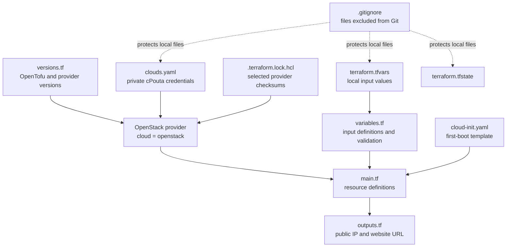
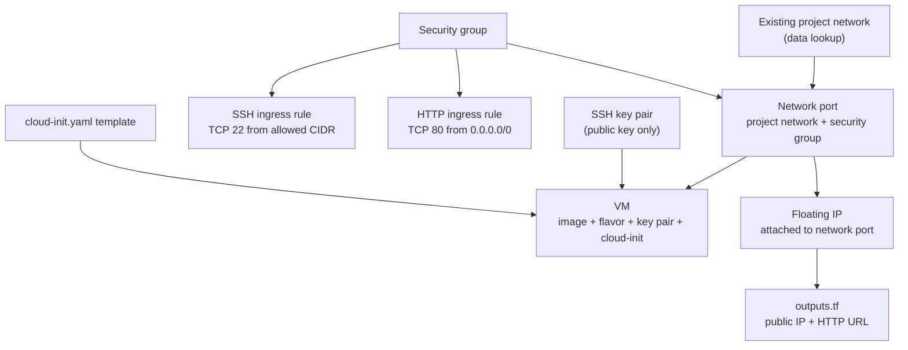

# Week 7: Rebuilding a Web Server with OpenTofu

## Goal

This project rebuilds a Linux web server on CSC cPouta using OpenTofu. The configuration creates a VM, registers an SSH public key, sets up a security group, attaches a public floating IP, and uses cloud-init to install and configure Apache automatically.

The goal is to be able to plan, create, verify, destroy, and recreate the infrastructure from the command line.

## Prerequisites and Security

- OpenTofu is installed. On macOS with Homebrew:

  ```bash
  brew install opentofu
  tofu version
  ```

- You have access to a CSC cPouta project and know the name of its project network.
- You have an OpenStack `clouds.yaml` file for cPouta. Keep this file private.
- You have an SSH key pair. OpenTofu uploads only the public key; keep the private key outside the repository.
- Your current public IP address is needed to restrict SSH access:

  ```bash
  curl https://ifconfig.me
  ```

- Before committing anything, check that credentials, personal variable values, and local state are ignored by Git:

  ```bash
  git check-ignore clouds.yaml terraform.tfvars terraform.tfstate
  ```

  The command should print the paths that are ignored. Never add credentials, private SSH keys, personal `.tfvars` files, or state files to Git or screenshots. The provider lock file, `.terraform.lock.hcl`, is different: it records provider selections and should normally be committed.

## Files in This Project

| File                  | Purpose                                                                                                                                              | Relationship to `main.tf`                                                                                                                                    |
| --------------------- | ---------------------------------------------------------------------------------------------------------------------------------------------------- | ------------------------------------------------------------------------------------------------------------------------------------------------------------ |
| `main.tf`             | Defines the OpenStack data lookup and resources: SSH key pair, security group and rules, network port, VM, and floating IP.                          | Connects input values and the cloud-init template to OpenStack resources. Resource references tell OpenTofu what depends on what.                            |
| `versions.tf`         | Sets the minimum OpenTofu version and the OpenStack provider source and version range. It also configures the provider to use the `openstack` cloud. | Selects the provider OpenTofu needs in order to interpret and run the resources in `main.tf`.                                                                |
| `variables.tf`        | Declares input variables, their types and descriptions, and validation rules such as checking the SSH CIDR value.                                    | Defines the `var.*` inputs used by `main.tf` and the cloud-init template.                                                                                    |
| `terraform.tfvars`    | Supplies this deployment's values, such as the student name, SSH public key path, allowed SSH CIDR, and project network.                             | OpenTofu uses these values for the variables referenced in `main.tf`. This file is ignored by Git.                                                           |
| `cloud-init.yaml`     | Gives the VM first-boot instructions, including installing Apache and writing the web page.                                                          | `main.tf` renders this template with the student name and page message, then passes it to the VM as `user_data`.                                             |
| `clouds.yaml`         | Stores the OpenStack cloud connection and application credential settings.                                                                           | The provider configured in `versions.tf` uses the cloud named `openstack` to connect to cPouta. The file must be kept private and available to the provider. |
| `outputs.tf`          | Declares the public IP and website URL to print after deployment.                                                                                    | Reads the address of the floating IP resource created in `main.tf`.                                                                                          |
| `.gitignore`          | Excludes credentials, personal variable files, private key files, OpenTofu state, and local working files from Git.                                  | Does not affect deployment. It helps prevent sensitive or machine-local files from being committed.                                                          |
| `.terraform.lock.hcl` | Records the selected provider version and package checksums. OpenTofu creates or updates it during initialization.                                   | Helps keep the OpenStack provider selection consistent when the project is initialized on another machine.                                                   |

### File and Resource Dependency Diagram



### OpenStack Resource Dependencies

The network named in `project_network` already exists in cPouta. The data source looks it up; OpenTofu does not create or delete that existing network.



OpenTofu infers these dependencies from resource references in `main.tf`. During creation it creates prerequisites before resources that use them. During destruction it removes dependent resources before their prerequisites. Independent resources may be created or removed at the same time.

## Deployment Procedure

Run the commands from the project directory:

```bash
cd week-7
```

### 1. Prepare the SSH Key and Input Values

Check whether a public SSH key already exists:

```bash
ls -la ~/.ssh
```

If necessary, create a key pair:

```bash
ssh-keygen -t ed25519 -C "your_email@example.com"
```

Use the public key path, such as `~/.ssh/id_ed25519.pub`, in `terraform.tfvars`. Never copy the private key into this project.

Get the public IP address for the machine from which you will SSH:

```bash
curl https://ifconfig.me
```

Set `ssh_allowed_cidr` in your private `terraform.tfvars` to that address followed by `/32`. Also set your student name, public key path, and actual cPouta project network name. Do not copy example values literally.

The OpenStack provider is configured with `cloud = "openstack"`. Make sure the provider can find the corresponding `openstack` entry in `clouds.yaml`. If the file is in this project directory and is not found automatically, set its path in the current terminal:

```bash
export OS_CLIENT_CONFIG_FILE="$PWD/clouds.yaml"
```

This environment variable applies only to the current terminal session. Set it again in a new terminal if needed.

### 2. Initialize, Format, and Validate

Download the configured provider:

```bash
tofu init
```

Format the OpenTofu files:

```bash
tofu fmt
```

Check the configuration for syntax and reference errors:

```bash
tofu validate
```

Continue when initialization succeeds and validation reports that the configuration is valid. If a `.tf` file was changed, run `tofu fmt` and `tofu validate` again.

### 3. Review and Apply the Plan

Preview the changes before creating anything:

```bash
tofu plan
```

Review the resource names, security rules, and planned additions, changes, or replacements. A `+` indicates a resource to add, `~` an in-place change, and `-/+` a destroy-and-recreate replacement. Values such as a floating IP may be shown as known only after apply.

Create the infrastructure:

```bash
tofu apply
```

Read the plan shown by OpenTofu. If it is correct, type `yes` when prompted. At completion, OpenTofu reports the resources it changed and prints the outputs declared in `outputs.tf`, including `public_ip` and `web_url`.

The exact resource count depends on the current OpenTofu state and what has already been created. In this configuration, `main.tf` declares a key pair, a security group, two security group rules, a network port, a VM, and a floating IP. The existing project network is looked up rather than created.

### 4. Verify the Web Server and SSH Access

Read the website URL from the OpenTofu output:

```bash
tofu output web_url
```

Open that URL in a browser, or check it from the terminal:

```bash
curl "$(tofu output -raw web_url)"
```

On the first boot, cloud-init may need time to install and configure Apache. If the page is not ready immediately, wait briefly and try again.

If SSH access is needed, connect using the matching private key:

```bash
ssh -i ~/.ssh/id_ed25519 ubuntu@"$(tofu output -raw public_ip)"
```

Use the correct key path and VM login name for your setup. SSH should be permitted only from the CIDR configured in `terraform.tfvars`; HTTP is permitted from anywhere by the current port 80 rule.

### 5. Update files

Login to ubuntu VM

```bash
ssh -i ~/.ssh/id_ed25519 ubuntu@your public IP
```

```bash
scp index.html ubuntu@your public IP:/tmp/index.html
sudo mv /tmp/index.html /var/www/html/index.html
sudo chmod 644 /var/www/html/index.html
```

## Important `cloud-init` Check

Before relying on Apache being enabled at boot, check the `runcmd` entry in `cloud-init.yaml`. The current file has:

```yaml
- systemctl enable -- now apache2
```

There should be no space inside the `--now` option. Use this command instead:

```yaml
- systemctl enable --now apache2
```

After changing the template, run `tofu fmt`, `tofu validate`, and `tofu plan`. Because the rendered template is passed as VM `user_data`, applying this change may replace the VM. Review that replacement before applying.

## Cleanup

When the server is no longer needed, remove the resources managed by OpenTofu:

```bash
tofu destroy
```

Review the proposed deletions and type `yes` to confirm. Do not manually delete the local state file as a cleanup step: OpenTofu uses it to know which resources it manages.
